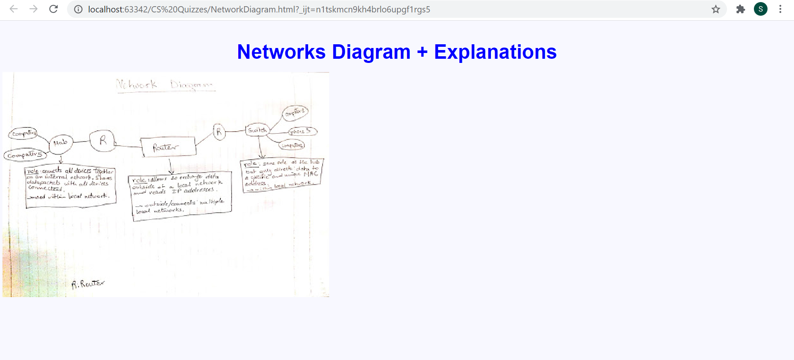

# Network Diagram + Components Explanations
 <br> 
### HTML Code
```.html
<!DOCTYPE html>
<html lang="en">
<head>
    <meta charset="UTF-8">
    <title>Network Diagram</title>
    <style>
        .page {
            background-color: ghostwhite;
        }
        .title{
            color: blue;
            font-family: Arial;
            font-size: xx-large;
            font-weight: bold;
            text-align: center;
        }
    </style>
</head>
<body class="page">
<p class="title">Networks Diagram + Explanations</p>

</body>
</html>
```
