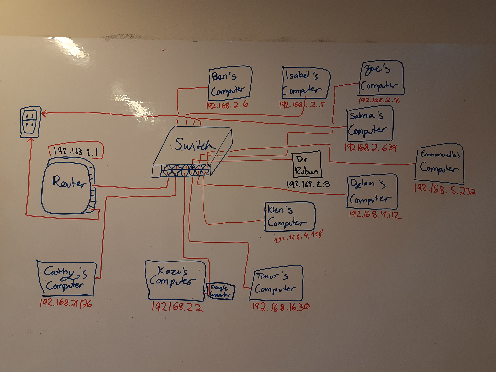

# Exercice about Networks in class 22-4-2021
   
### Description 
We were given several components necessary to make a small network. Our class worked to connect the router and switch to each other and to computers. With the help of our teacher, we were all able to connect to the network and share a file among each other. It was a very good exercice to practise what we learned in the videos on Managebac.
