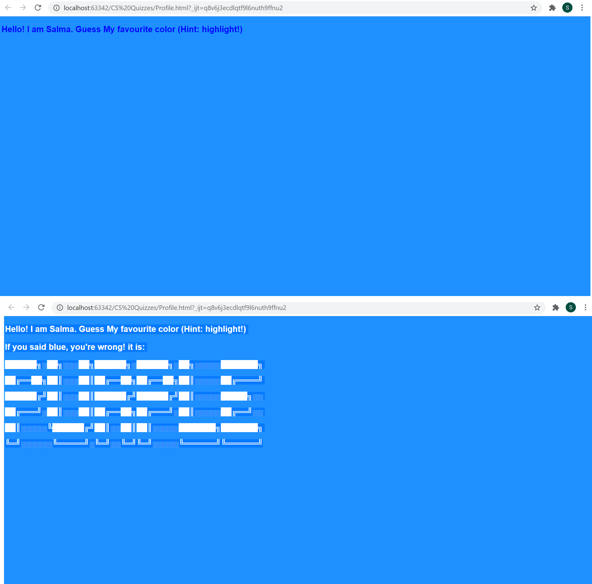

# My Profile Website
 <br> 
### HTML / CSS Code
```.html
!DOCTYPE html>
<html lang="en">
<head>
    <meta charset="UTF-8">
    <title>My Profile | Salma</title>
    <style>
        .page {
            background-color: dodgerblue;
        }
        .hidden_text{
            color: dodgerblue;
            font-family: Arial;
            font-size: large;
            font-weight: bold;
        }
        .color{
            color: dodgerblue;
        }
        .title{
            color: blue;
            font-family: Arial;
            font-size: large;
            font-weight: bold;
        }
    </style>
</head>
<body class="page">
    <p class="title">Hello! I am Salma. Guess My favourite color (Hint: highlight!)</p>
    <p class="hidden_text">If you said blue, you're wrong! it is:</p>
    <p class="color"> ██████╗░██╗░░░██╗██████╗░██████╗░██╗░░░░░███████╗</p>
    <p class="color"> ██╔══██╗██║░░░██║██╔══██╗██╔══██╗██║░░░░░██╔════╝</p>
    <p class="color"> ██████╔╝██║░░░██║██████╔╝██████╔╝██║░░░░░█████╗░░</p>
    <p class="color"> ██╔═══╝░██║░░░██║██╔══██╗██╔═══╝░██║░░░░░██╔══╝░░</p>
    <p class="color"> ██║░░░░░╚██████╔╝██║░░██║██║░░░░░███████╗███████╗</p>
    <p class="color"> ╚═╝░░░░░░╚═════╝░╚═╝░░╚═╝╚═╝░░░░░╚══════╝╚══════╝</p>

</body>
</html>
``` 
