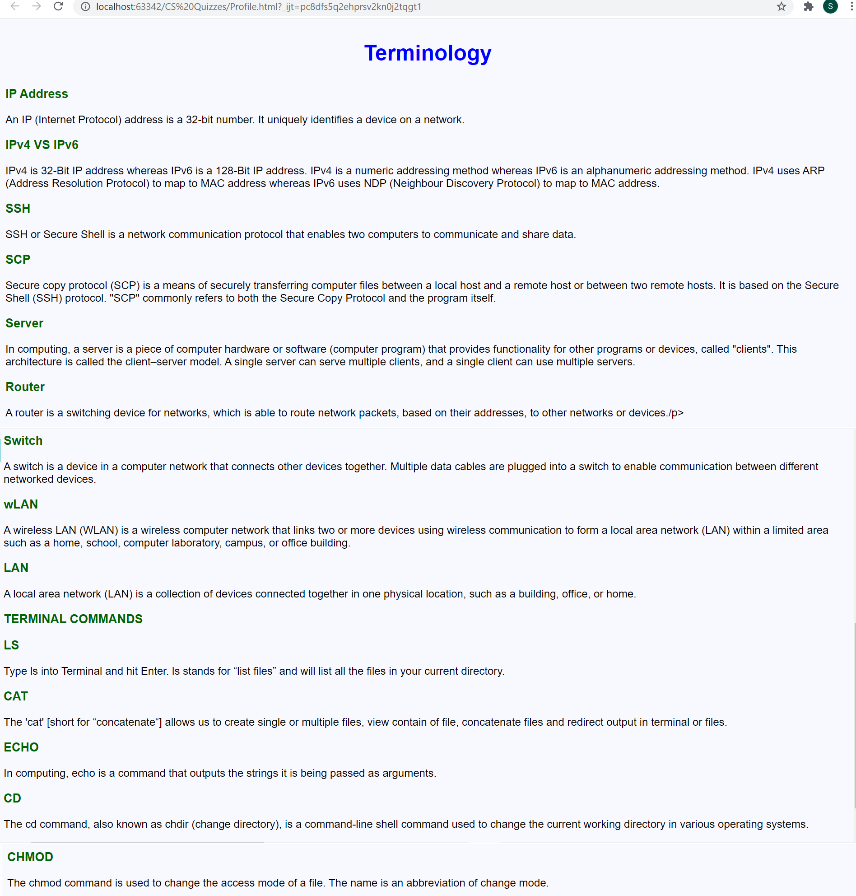

# Terminology Notes
 <br> 
### HTML Code
```.html
<!DOCTYPE html>
<html lang="en">
<head>
    <meta charset="UTF-8">
    <title>Terminology</title>
    <style>
        .page {
            background-color: ghostwhite;
        }
        .terms{
            color: darkgreen;
            font-family: Arial;
            font-size: large;
            font-weight: bold;
        }
        .title{
            color: blue;
            font-family: Arial;
            font-size: xx-large;
            font-weight: bold;
            text-align: center;
        }
        .text{
            color: black;
            font-family: Arial;
            font-size: medium;
        }
    </style>
</head>
<body class="page">
    <p class="title">Terminology</p>
    <p class="terms">IP Address</p>
    <p class="text">An IP (Internet Protocol) address is a 32-bit number. It uniquely identifies a device on a network.</p>
    <p class="terms">IPv4 VS IPv6</p>
    <p class="text">IPv4 is 32-Bit IP address whereas IPv6 is a 128-Bit IP address. IPv4 is a numeric addressing method whereas IPv6 is an alphanumeric addressing method. IPv4 uses ARP (Address Resolution Protocol) to map to MAC address whereas IPv6 uses NDP (Neighbour Discovery Protocol) to map to MAC address.</p>
    <p class="terms">SSH</p>
    <p class="text">SSH or Secure Shell is a network communication protocol that enables two computers to communicate and share data.</p>
    <p class="terms">SCP</p>
    <p class="text">Secure copy protocol (SCP) is a means of securely transferring computer files between a local host and a remote host or between two remote hosts. It is based on the Secure Shell (SSH) protocol. "SCP" commonly refers to both the Secure Copy Protocol and the program itself.</p>
    <p class="terms">Server</p>
    <p class="text">In computing, a server is a piece of computer hardware or software (computer program) that provides functionality for other programs or devices, called "clients". This architecture is called the client–server model. A single server can serve multiple clients, and a single client can use multiple servers.</p>
    <p class="terms">Router</p>
    <p class="text">A router is a switching device for networks, which is able to route network packets, based on their addresses, to other networks or devices./p>
    <p class="terms">Switch</p>
    <p class="text">A switch is a device in a computer network that connects other devices together. Multiple data cables are plugged into a switch to enable communication between different networked devices.</p>
    <p class="terms">wLAN</p>
    <p class="text">A wireless LAN (WLAN) is a wireless computer network that links two or more devices using wireless communication to form a local area network (LAN) within a limited area such as a home, school, computer laboratory, campus, or office building.</p>
    <p class="terms">LAN</p>
    <p class="text">A local area network (LAN) is a collection of devices connected together in one physical location, such as a building, office, or home. </p>
    <p class="terms">TERMINAL COMMANDS</p>
    <p class="terms">LS</p>
    <p class="text">Type ls into Terminal and hit Enter. ls stands for “list files” and will list all the files in your current directory.</p>
    <p class="terms">CAT</p>
    <p class="text">The 'cat' [short for “concatenate“] allows us to create single or multiple files, view contain of file, concatenate files and redirect output in terminal or files.</p>
    <p class="terms">ECHO</p>
    <p class="text">In computing, echo is a command that outputs the strings it is being passed as arguments.</p>
    <p class="terms">CD</p>
    <p class="text">The cd command, also known as chdir (change directory), is a command-line shell command used to change the current working directory in various operating systems.</p>
    <p class="terms">CHMOD</p>
    <p class="text">The chmod command is used to change the access mode of a file. The name is an abbreviation of change mode.</p>

</body>
</html>
```
