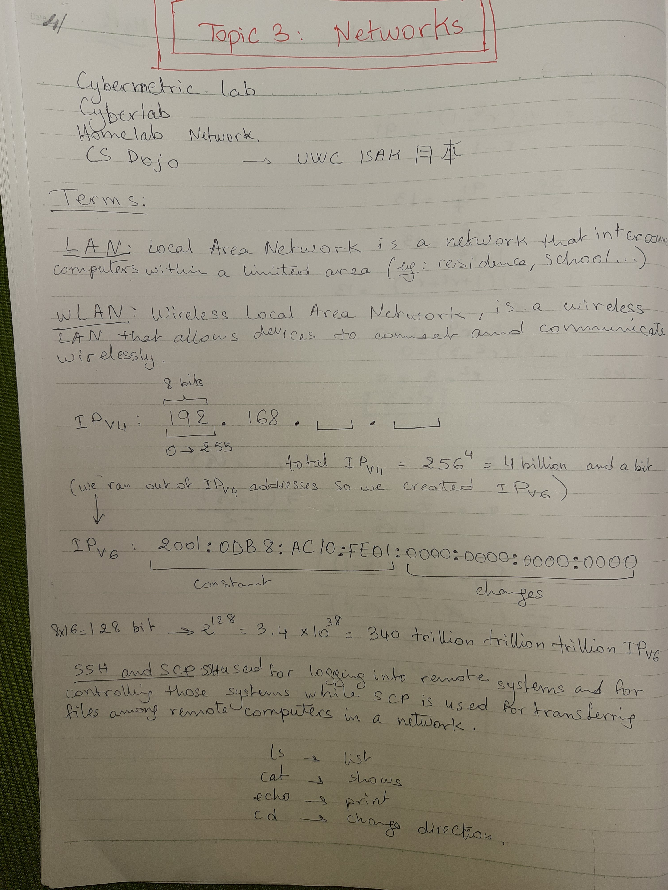
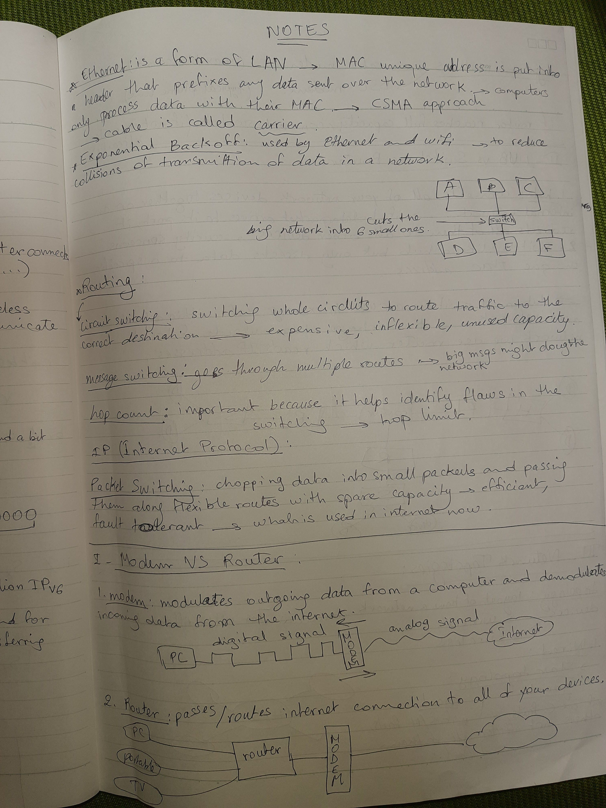
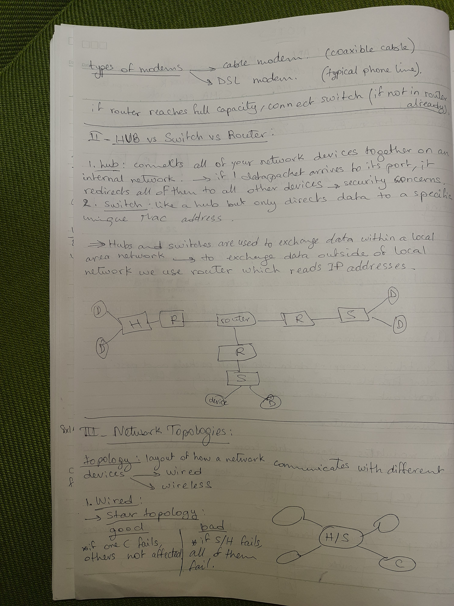
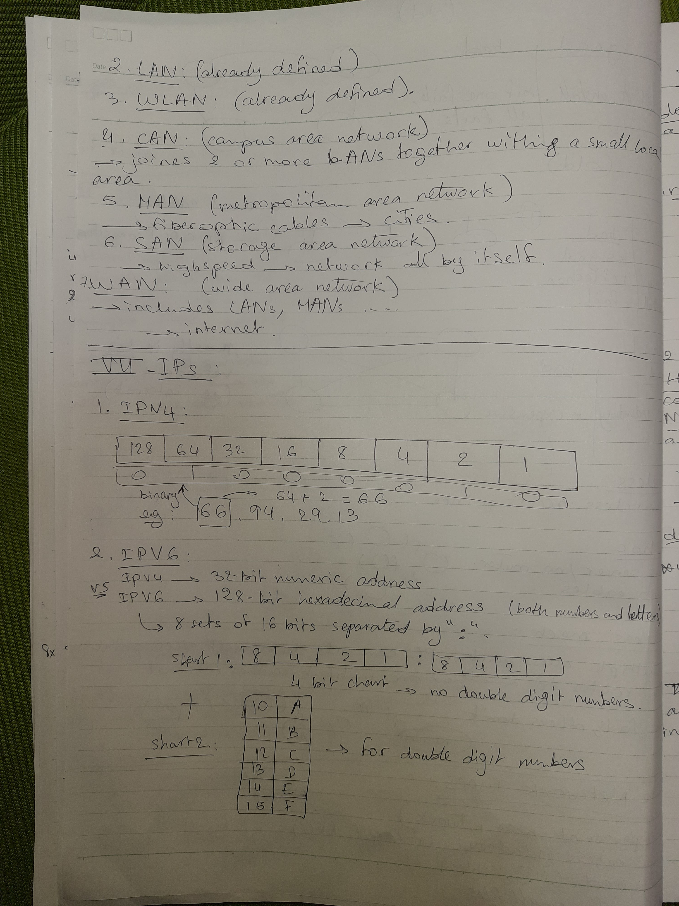
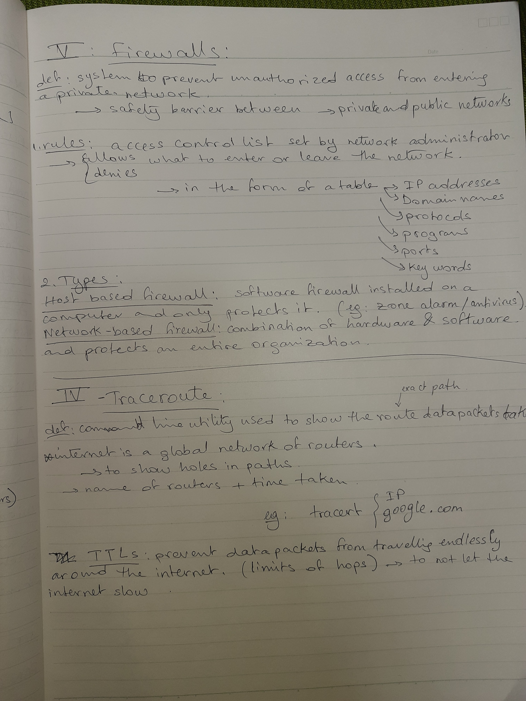

# Terminology / Notes
   
   
   
   
   
   
### Why do most IPv4 addresses start with 192.168.*.* ?
--> Private addresses like 192.168.*.* are by far the most common IP addresses used across the world because they can be re-used over and over again, just like phone extension numbers. But you still need a public IP address for your house or business so that you can communicate with others outside, and these pubic addresses are globally unique and are allocated by ISPs (Internet Service Providers). If you didn’t have this arrangement with the majority of devices in the world using the same set of private IP addresses then the IPv4 public address space on the internet would have run out a decade ago.
