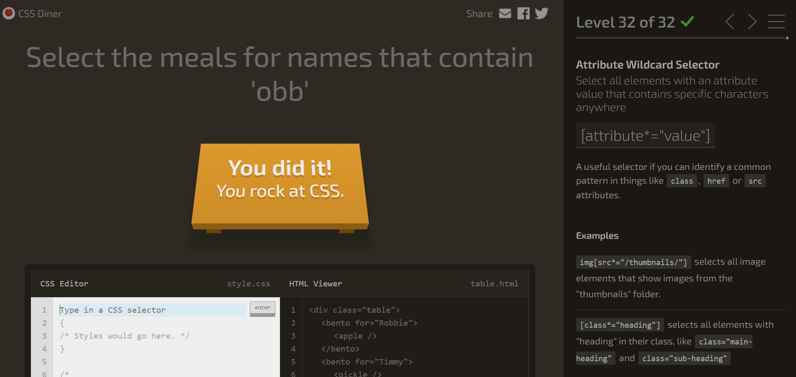

# Diner CSS - Salma 
1. plate 
2. bento 
3. #fancy
4. plate apple
5. #fancy pickle
6. .small
7. orange.small
8. bento orange.small
9. plate, bento
10. *
11. plate *
12. plate + apple
13. bento ~ pickle
14. plate > apple
15. orange: first-child
16. plate * : only-child
17. #fancy: * : last-child, plate+pickle
18. plate:nth-child(3)
19. bento:nth-last-child(3)
20. apple:first-of-type
21. plate:nth-of-type(2n)
22. plate:nth-of-type(2n+3)
23. plate apple.small:only-of-type
24. orange:last-of-type, apple:last-of-type
25. bento:empty
26. apple:not(.small)
27. [for]
28. plate[for]
29. [for="Vitaly"]
30. [for^="Sa"]
31. [for$="ato"]
32. [for*="obb"]  

   

## Reflection:
This game was actually a lot of fun. I was a bit confused towards the beggining on what I am supposed to do, but then after reading the guide I started to get the hang of it. It is definetely a good way to practise CSS selection skills visually and it helped me significally understand how CSS works better.
